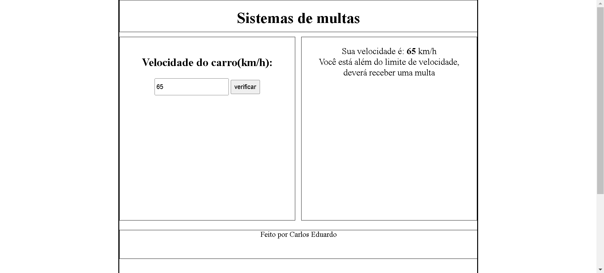
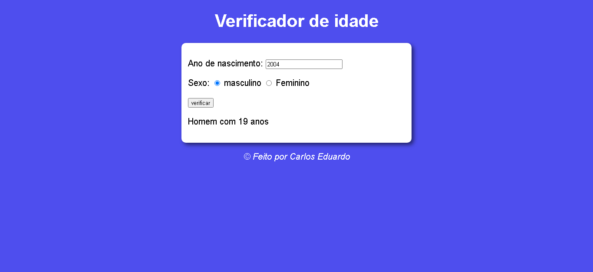
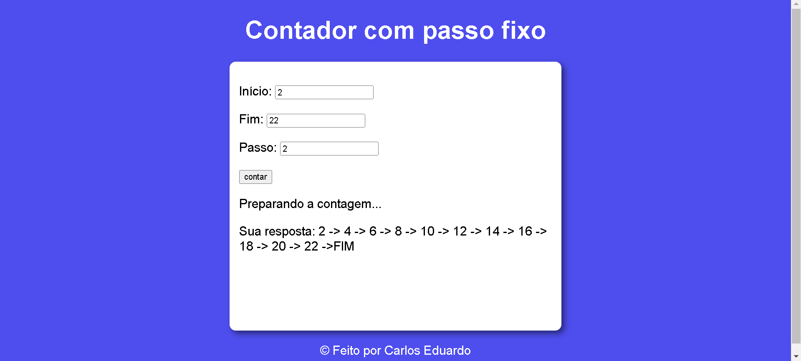
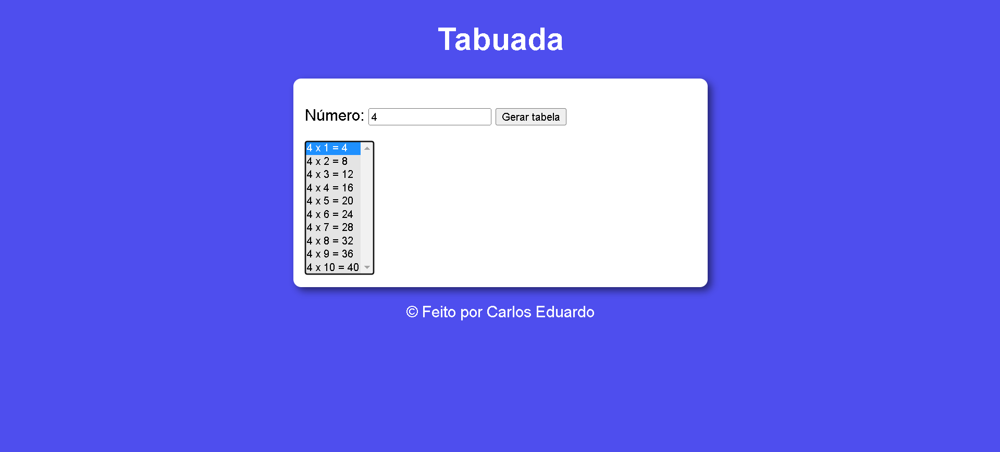
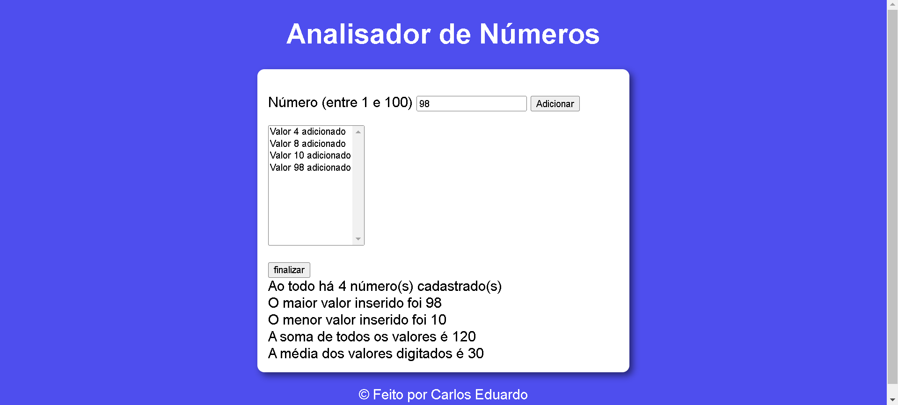
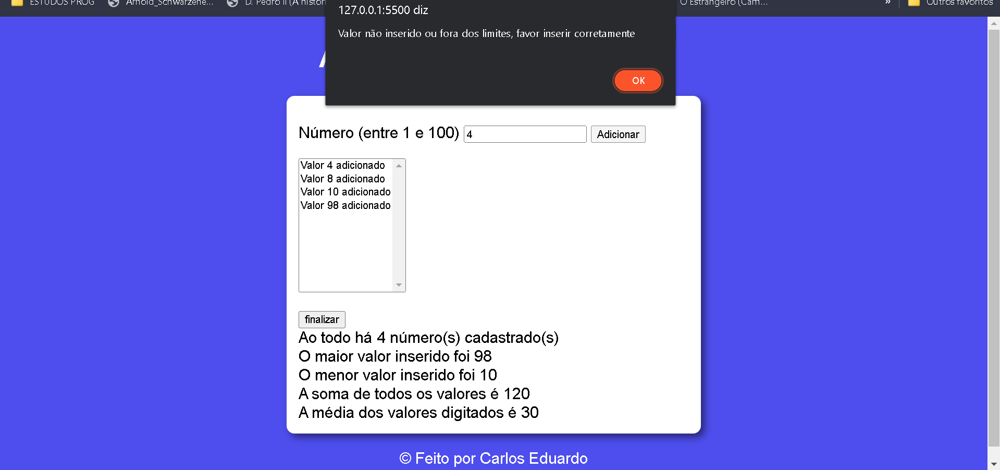

<h1 align="center"> Projetos fixação de JavaScript </h1>

Conjunto de projetos de JavaScript feito para o "Curso Em Vídeo" de JS. Cada projeto busca fixar conceitos básicos como repetições, variáveis, condições, funções e DOM 

  <a href="#🚀-tecnologias">Tecnologias</a>&nbsp;&nbsp;&nbsp;|&nbsp;&nbsp;&nbsp;
  <a href="#💻-projetos">Projetos</a>

 

## 🚀 Tecnologias

Esse projeto foi desenvolvido com as seguintes tecnologias:

- JavaScript
- HTML e CSS
- Git e Github

## 💻 Projetos

- Exemplo 10 - Sistemas de Multas

Sistema com "input" de velocidade que responde a velocidade e se excedeu o limite.

  

 

- Exemplo 13 - Horário do dia

Projeto que mostra o horário do client e usa esse horário para determinar o fundo e imagem.

  
  
  

 

- Exemplo 14 - Sistemas de idade

Sistema que cruza os "inputs" de sexo e idade

  

 

- Exemplo 16 - Contador com passo fixo

Projeto contador, com ínicio, fim e passos a serem mostrados

  

 

- Exemplo 17 - Tabuada

Lista de tabuada selecionável 

  

 

- Exemplo FINAL - Analisador cascata de números

Projeto final que adicionam os números em cascata e depois analisam eles. Nesse projeto há restrições, como os números só poderem ser de 1-100, não entrarem números repetidos e também não funcionar sem valor. Além disso, a análise feita quando se clica no botão finalizar mostra o total de número cadastrados, maior e menor número inserido, a soma de todos valores e a média de todos valores

  
  

